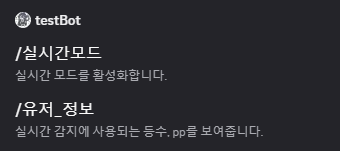
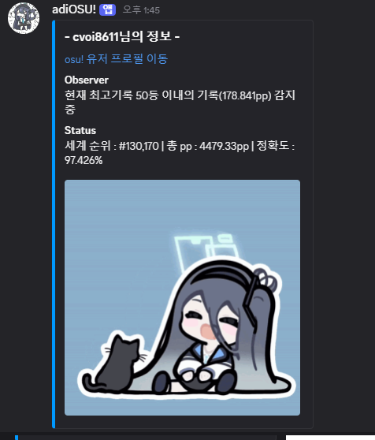

# AdiOSU!

게임 osu! 에 관련된 기능들을 보유하고있는 Discord Bot입니다.

대충 이름은 AdiOSU! 로 붙였습니다.

## 사용한 기술

 

  

## 기능

### 유저 기록 감시
- 특정 유저의 기록을 API를 통해 주기적으로 조회
- 봇 실행 시 무한 루프 기반 풀링 구조로 지속적인 상태 감시 수행
### 최고 기록 갱신 감지
- 기존 기록 대비 더 높은 기록이 발생시 감지함
- 기록 갱신 시
  - Discord 채널에 메시지 전송
  - 갱신된 기록을 따로 저장한 후, 기준 데이터로 활용함
### 유저 개인 status 변경점 추적
- 기록 정보와 함께 유저 메타데이터 관리
- 다음 항목에 대해서 변화량도 같이 출력함
  - 정확도, 등수, pp 등
### 비트맵 정보 출력 기능
- 비트맵 링크를 올리면, 봇이 이를 감지하여 맵 정보를 보기 편하게 출력함
### API 요청 제한 대응
- API 요청 횟수를 내부적으로 카운트
- 요청 수 기반 쓰로틀링(Throttling) 로직 적용
- API Rate Limit 초과를 방지하도록 일정 요청 횟수 초과 시 API 요청 일시정지
### Node.js 기반 비동기 처리 구조
- 비동기 API 호출 및 메시지 전송 처리
- 장시간 실행에도 안정적인 이벤트 루프 유지

## 명령어

|Commands|Input|Description|
|--|--|--|
|/실시간모드|1 or 0|data.json에 등록된 유저들의 기록을 실시간으로 감시합니다.|
|/유저_정보| username | 유저명과 실시간 감시 기능에 특정되는 기록을 보여줍니다.|
|osu 맵 링크| osu beatmap url | osu 비트맵 또는 비트맵셋 링크를 올리면 맵의 대략적인 정보를 보여줍니다.|

___
### 실시간 모드

- **첫 실행 시 나오는 화면**

- **실시간 모드 중, 신기록을 갱신하면 출력되는 메시지**

___

- 실시간 모드를 활성화하면 봇이 실행되어 일정 시간 간격으로 유저 기록 API를 주기적으로 조회합니다.

- 이전에 저장된 기록을 기준으로 최신 기록을 비교하며,  
  설정된 조건을 만족하는 기록 갱신(High Score) 이 감지될 경우 Discord 메시지로 알림을 출력합니다.

- 기록이 갱신될 때 단순 점수 정보뿐만 아니라, 유저 정보의 변화량도 함께 표시됩니다.  

- 갱신된 기록은 내부 저장소에 저장되며, 이후 비교 기준 데이터로 사용되어 불필요한 API 요청 횟수를 최소화하였습니다.

- 해당 과정은 무한 루프 기반 폴링 구조로 동작하며, 봇이 종료되기 전까지 지속적으로 반복됩니다.

___

### 유저_정보

 | 
-- | -- |

- **각각, 정상적으로 작동된 경우와 아닌 경우의 메시지**

___

- 기록 감시와 함께 유저의 메타 정보도 동시에 관리합니다.

- 다음과 같은 유저 정보 항목을 저장하고 비교합니다:
  - 정확도 (Accuracy)
  - 개인 랭킹 (Ranking)
  - 총 pp량 (Performance Point)
  - 기타 유저 프로필 관련 정보

- 새로운 API 응답과 기존 저장된 데이터를 비교하여,  
  변경된 항목만 선별적으로 출력함으로써 불필요한 정보 노출을 줄이고 가독성을 높였습니다.

- 이를 통해 단순 기록 갱신뿐만 아니라, 유저 상태 변화 추적용 봇으로도 활용할 수 있습니다.

___

### osu 맵 링크

- 채팅에 osu! 비트맵 링크를 입력하면 해당 맵에 대한 정보를 자동으로 분석하여 출력합니다.

- 출력되는 정보에는 다음이 포함됩니다:

- 맵 기본 정보 (제목, 길이, 아티스트 등)

- 난이도 정보

- 기타 메타데이터

- 단발성 요청 기반 기능으로, 실시간 모드와 독립적으로 사용할 수 있습니다.