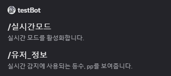
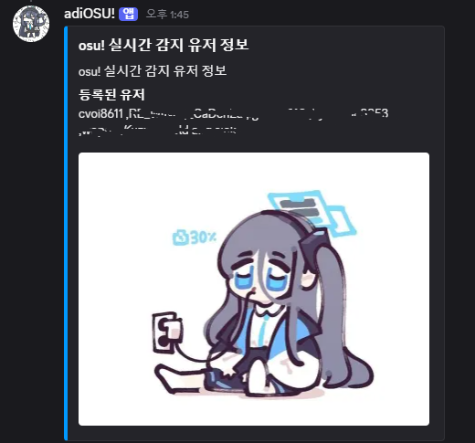
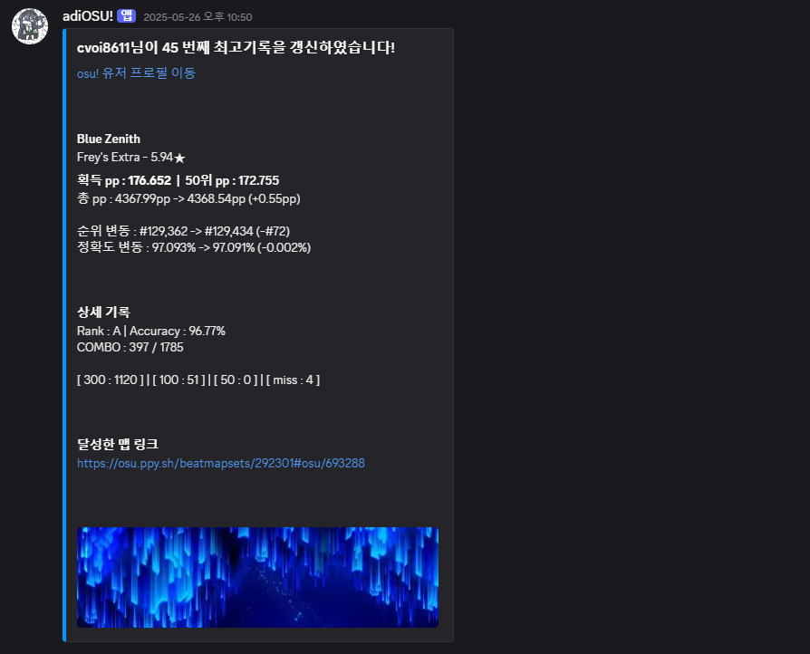
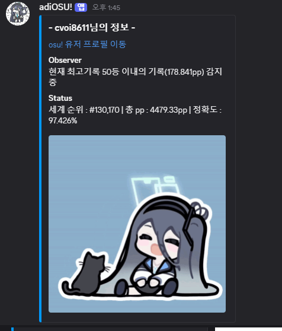
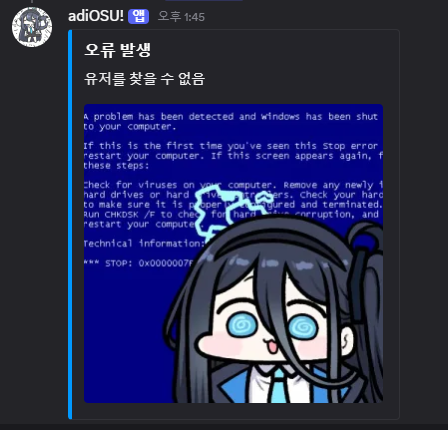
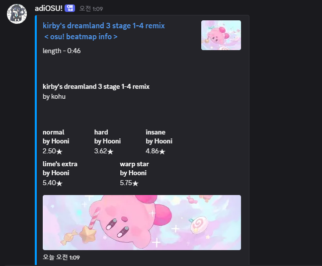

# AdiOSU!

osu! 관련 기능들을 모아놓은 Discord Bot입니다. 이름은 AdiOSU! 입니다.

## 사용한 기술

 

  

## 기능

### 유저 기록 감시
- 등록된 유저의 기록을 osu! API를 통해 주기적으로 조회
- 무한 루프 기반 폴링 구조로 봇이 실행되는 동안 지속적으로 감시

### 최고 기록 갱신 감지
- 최근 기록과 Top 50 기록을 비교하여 신기록 여부 판단
- 신기록 감지 시 Discord 채널에 결과 메시지 전송
- 갱신된 기록은 내부에 저장되어 이후 비교 기준으로 활용

### 유저 상태 변화 추적
- 신기록 감지 시 pp, 정확도, 세계 순위 변화량도 함께 출력

### 모드별 난이도 반영
- Hidden, HardRock, DoubleTime, Nightcore, Flashlight 등 난이도에 영향을 주는 모드 적용 시 해당 모드 기준의 난이도 수치를 출력

### 비트맵 정보 출력
- 채팅에 osu! 비트맵 링크를 올리면 맵 정보를 자동으로 파싱하여 출력

### API 요청 제한 대응
- API 요청 횟수를 내부적으로 카운트하여 Rate Limit 초과 방지
- 일정 횟수 초과 시 요청 일시 정지 (Throttling)

### 로깅
- Winston 기반 로그 파일 저장 (일별 분리, 30일 자동 삭제)
- Docker 콘솔(docker logs)에서 실시간 확인 가능

## 명령어

|Commands|Input|Description|
|--|--|--|
|/실시간모드|1 or 0|등록된 유저들의 기록을 실시간으로 감시합니다.|
|/유저_정보|username|유저명과 실시간 감시 기준 정보를 보여줍니다.|
|/check_score|username, score_id|해당 유저의 score_id가 Top 50 이내 기록인지 확인하고 결과를 출력합니다.|
|osu 맵 링크|osu beatmap url|osu! 비트맵 링크를 올리면 맵 정보를 출력합니다.|

___

### 실시간 모드

- **첫 실행 시 나오는 화면**

- **신기록 갱신 시 출력되는 메시지**

___

- 실시간 모드를 활성화하면 일정 시간 간격으로 유저 기록 API를 반복 조회합니다.

- 최근 기록과 Top 50 기록을 비교하여 신기록이 감지되면 Discord 채널에 알림을 전송합니다.

- 신기록 메시지에는 기록 정보 외에도 pp, 정확도, 세계 순위 변화량이 포함됩니다.

- 적용된 모드에 따라 별 수(★)도 해당 모드 기준으로 반영되어 출력됩니다.

___

### 유저_정보

 | 
-- | -- |

- **각각 정상 작동된 경우와 유저를 찾지 못한 경우**

___

- 실시간 감시 기준으로 저장된 유저 정보를 조회합니다.

- 저장된 항목: 정확도, 세계 순위, 총 pp, 기준 pp

___

### check_score

- username과 score_id를 직접 입력하여, 해당 기록이 Top 50 이내에 있는지 확인합니다.

- Top 50 이내 기록이면 실시간 모드와 동일한 형태의 결과 메시지를 출력합니다.

- 실시간 모드와 무관하게 독립적으로 사용 가능한 테스트용 명령어입니다.

___

### osu 맵 링크

- 채팅에 osu! 비트맵 링크를 입력하면 해당 맵 정보를 자동으로 파싱하여 출력합니다.

- 출력 항목: 맵 제목, 아티스트, 길이, 난이도(★), 기타 메타데이터

- 실시간 모드와 독립적으로 동작합니다.
